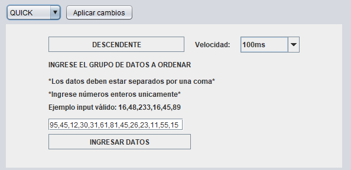
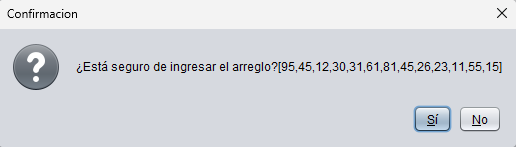
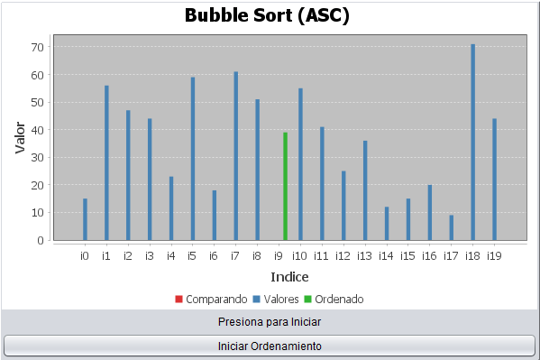
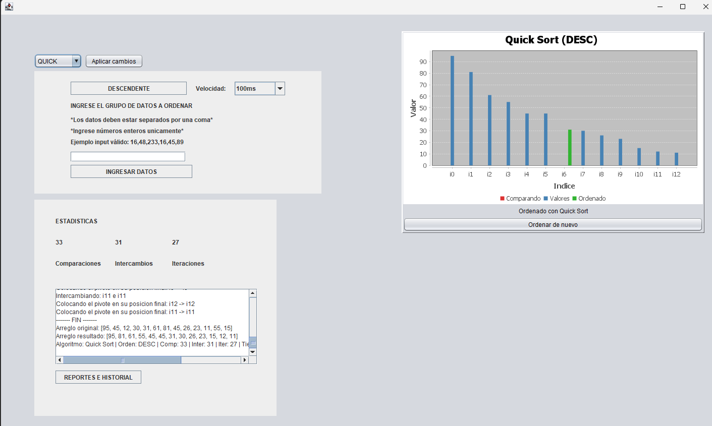
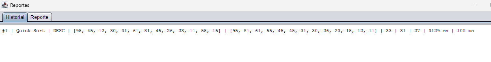
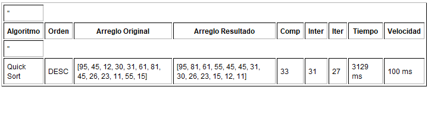

# Manual de usuario

_Realizado por Gonzalo Montezuma - 202504046_

## UI principal

Al abrir el programa verá la siguiente interfaz gráfica

En este apartado usted debe elegir la configuración que desee

* Puede modificar si desea ordenar de forma descendente o ascendente (el botón mostrará el texto, de la opción activa, en la imagen indica que será descendente).

* Puede modificar el algoritmo, eligiendo entre quick, bubble y shell.

* Puede modificar la velocidad del display, con 500ms por paso 100ms por paso o 20ms por paso

Finalmente, tendrá la opción de ingresar nuevos datos, estos deben ser escritos de forma lineal, separados unicamente por una coma cada dato, no ingrese caracteres invalidos, ni escriba espacios. Al realizar esta acción, oprima el botón ingresar datos y confirme.

Al realizar estas acciones, finalice el procedimiento oprimiendo el botón de aplicar cambios, de esta forma, se actualizará el gráfico a su estado base.

En este gráfico oprima el botón de iniciar ordenamiento para correr el programa y visualizar el ordenamiento.

A la izquierda se mostrará un log que indica cada operación realizada durante la ejecución.

Luego al oprimir el botón de historial y reportes tendrá una nueva ventana donde podrá cambiar de pestaña, en la primera podra visualizar el historial de todos los ordenamientos ejecutados hasta el momento, y en los reportes verá información de cada ejecución en formato HTML.

